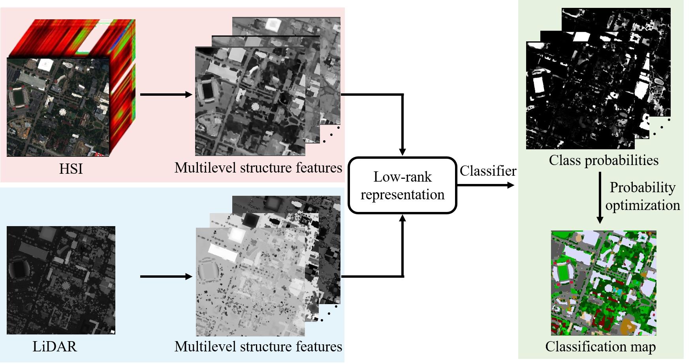

# Matlab Code for Multilevel structure extraction-based multi-sensor data fusion

[Puhong Duan](https://scholar.google.ch/citations?hl=en&user=IYUlx_8AAAAJ&view_op=list_works&sortby=pubdate), [Xudong Kang](https://scholar.google.ch/citations?user=5XOeLZYAAAAJ&hl=en), [Pedram Ghamisi](https://scholar.google.ch/citations?user=Gr9afd0AAAAJ&hl=en), [Yu Liu]()

___________

The code in this toolbox implements the ["Multilevel structure extraction-based multi-sensor data fusion"](https://www.mdpi.com/2072-4292/12/24/4034). More specifically, it is detailed as follow.

Citation
---------------------

**Please kindly cite the papers if this code is useful and helpful for your research.**

P. Duan, P.; Kang, X.; Ghamisi, P.; Liu, Y. Multilevel Structure Extraction-Based Multi-Sensor Data Fusion. Remote Sens. 2020, 12, 4034. https://doi.org/10.3390/rs12244034

    @article{MSE,
      title     = {Multilevel structure extraction-based multi-sensor data fusion},
      author    = {Duan, Puhong and Kang, Xudong and Ghamisi, Pedram and Liu, Yu},
      journal   = {Remote Sensing}, 
      volume    = {12},
      number    = {24},
      pages     = {4034},
      year      = {2020},
      publisher = {MDPI}
     }
     
# Usage
% Please run Testdemo

